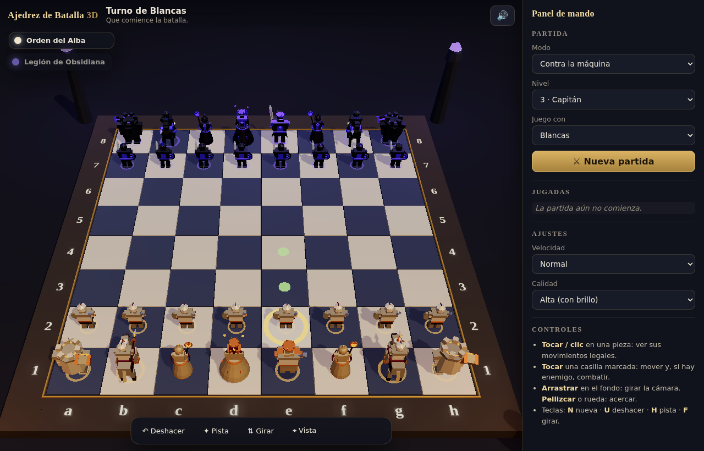

# Ajedrez de Batalla 3D

Ajedrez completo en 3D donde las piezas son guerreros animados: caminan hasta su
casilla, se baten en duelo cuando hay captura y caen destrozadas o se desvanecen
en un remolino de brasas. Pensado para jugarse con el dedo en una tablet o con el
ratón en el PC.



## Cómo ejecutarlo

No hay build ni dependencias que instalar: son archivos estáticos con módulos ES.
Como los módulos y el *worker* no funcionan desde `file://`, hay que servir la
carpeta por HTTP:

```bash
cd chess
python3 -m http.server 8000     # o: npx http-server -p 8000
```

Y abrir <http://localhost:8000>. También se puede publicar tal cual en GitHub
Pages, Netlify, Vercel o cualquier hosting estático.

## Qué hace

**Ajedrez de verdad.** Motor propio con todas las reglas: enroque corto y largo,
captura al paso, coronación con elección de pieza, jaque, jaque mate, rey ahogado,
regla de las 50 jugadas, triple repetición y material insuficiente. Validado con
las posiciones *perft* estándar (posición inicial hasta profundidad 4, *Kiwipete*,
y las posiciones 3, 4 y 5 de la suite clásica).

**Combate animado.** Cada tipo de pieza tiene su propia coreografía:

| Pieza | Cómo se mueve | Cómo mata |
|---|---|---|
| Peón | marcha corta con escudo y espada | dos asaltos: el defensor para el primero (chispas), el segundo entra |
| Caballo | galopa en dos tramos con salto | se encabrita y carga con la lanza |
| Alfil | flota con la túnica ondeando | carga el orbe del báculo y lanza un proyectil mágico |
| Torre | pisadas pesadas que levantan polvo | martillazo con onda de choque en el suelo |
| Dama | se desliza con capa y cristales orbitando | descarga de energía entre las manos |
| Rey | marcha lenta con capa | tres asaltos de mandoble |

Al morir, los guerreros de carne caen de espaldas, los golems de piedra se
desmoronan en fragmentos y los lanzadores de hechizos se disuelven en brasas.
El enroque es una maniobra conjunta (la torre rodea al rey), la coronación
transforma al peón en un pilar de luz y el jaque mate termina con el rey
derrotado de rodillas soltando la espada.

**Adversario.** Búsqueda alfa-beta con profundización iterativa, quiescencia,
tablas posicionales y ordenación de jugadas, ejecutada en un *Web Worker* para
que las animaciones no se entrecorten. Cinco niveles, de *Escudero* (juega
razonable pero falla a propósito) a *Archimago*. También hay modo de dos
jugadores en el mismo dispositivo y modo máquina contra máquina.

**Interfaz.** Lista de jugadas en notación algebraica, piezas capturadas y
ventaja material, pista del motor, deshacer, giro de tablero, vista cenital,
sonido sintetizado (sin archivos de audio) y tres niveles de calidad gráfica.

## Controles

- **Tocar / clic** en una pieza: muestra sus movimientos legales.
- **Tocar** una casilla marcada: mueve; si hay enemigo, empieza el combate.
- **Arrastrar** sobre el fondo: gira la cámara. **Pellizcar** o rueda del ratón: acerca.
- Teclas: `N` nueva partida · `U` deshacer · `H` pista · `F` girar · `Esc` deseleccionar.

## Cómo está hecho

Sin framework y sin assets externos: todo se genera por código.

```
chess/
├── index.html          estructura, importmap y diálogos
├── styles.css          interfaz adaptable (escritorio / tablet / móvil)
├── src/
│   ├── engine.js       reglas del ajedrez, SAN y FEN
│   ├── ai.js           evaluación y búsqueda alfa-beta
│   ├── ai-worker.js    la búsqueda, fuera del hilo principal
│   ├── models.js       piezas construidas con primitivas y esqueleto articulado
│   ├── anim.js         poses procedurales (marcha, galope, guardia, golpe, muerte…)
│   ├── combat.js       coreografía de cada jugada
│   ├── fx.js           partículas, ondas de choque, proyectiles y destellos
│   ├── board3d.js      escena, luces, cámara orbital táctil y selección
│   ├── audio.js        efectos de sonido sintetizados con WebAudio
│   ├── ui.js           panel, lista de jugadas y diálogos
│   └── main.js         orquestación del turno y los ajustes
└── vendor/three/       three.js r160 (MIT) incluido para no depender de un CDN
```

Las piezas no son modelos importados: cada una se arma con cajas, cilindros y
superficies de revolución agrupadas en un esqueleto (caderas, torso, cabeza,
brazos, piernas, arma, capa). Las geometrías rígidas de cada articulación se
fusionan en una o dos mallas con color por vértice, de modo que una pieza
completa cuesta unas diez llamadas de dibujo en lugar de cuarenta.

## Rendimiento

La calidad se detecta sola según memoria, núcleos y tamaño de pantalla, y se
puede forzar desde el panel:

- **Alta**: sombras suaves 2048 px y *bloom*.
- **Media**: sombras 1024 px, sin *bloom*.
- **Baja**: sin sombras, menos partículas y resolución limitada (tablets antiguas).

## Créditos

[three.js](https://threejs.org) r160, licencia MIT, incluido en `vendor/three/`.
Todo lo demás —modelos, animaciones, efectos, sonidos y motor de ajedrez— es
código de este repositorio.
